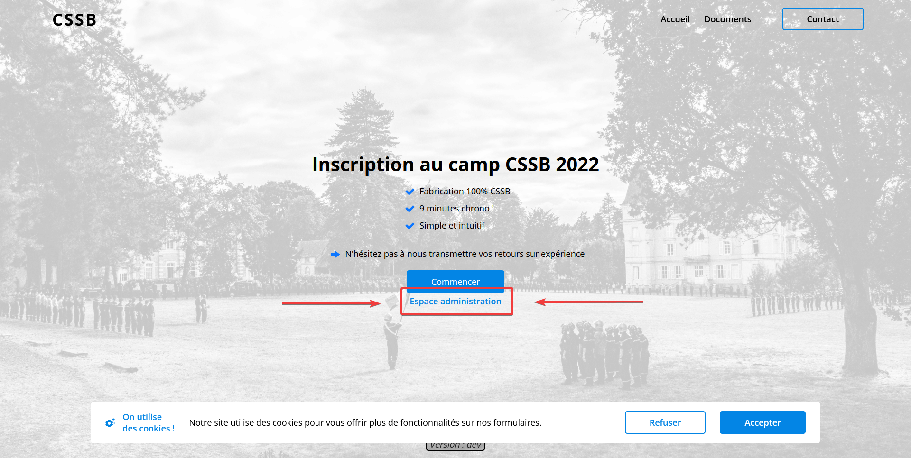
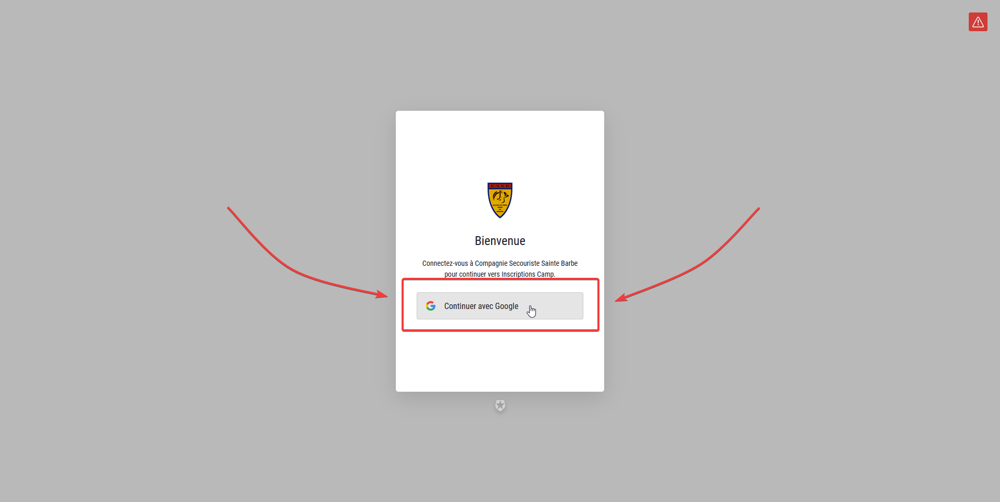
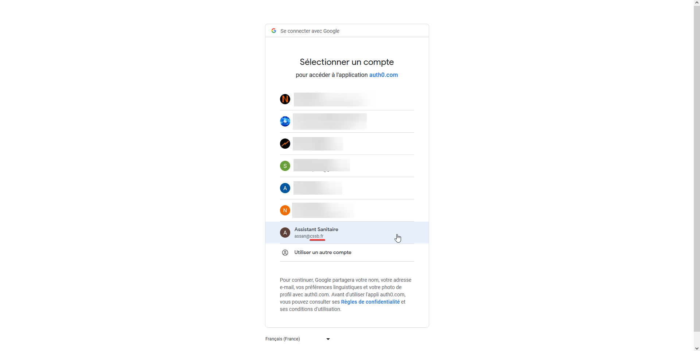
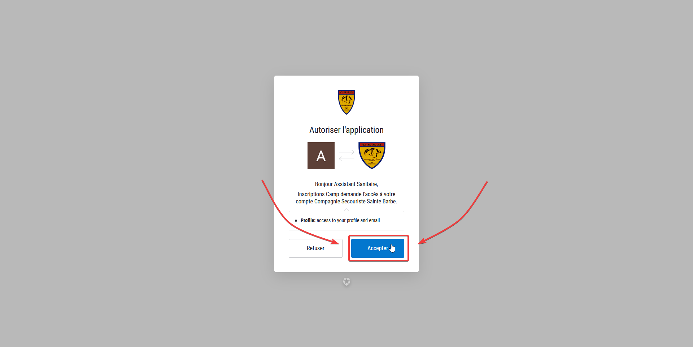
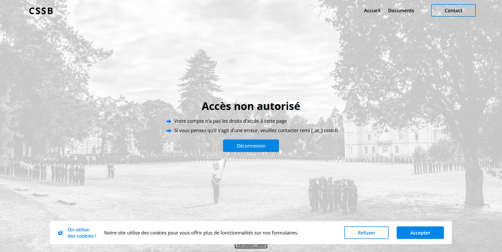
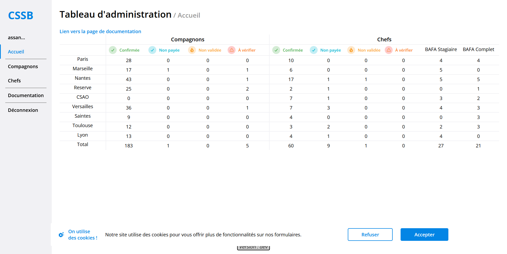

-----
# Première connection
Rendez vous sur la [plateforme d'inscription au camp](https://inscriptions-camp.cssb.fr/), et cliquez sur le bouton "Espace administration"

Vous êtes maintenant sur la page de connection, cliquez sur le bouton "Continuer avec Google"

Vous devez maintenant choisir le compte Google avec lequel vous souhaitez vous connecter. Selectionnez votre compte google CSSB, dont l'adresse email se termine par `@cssb.fr`

Cliquez sur accepter pour connecter votre compte google et la plateforme d'inscription au camp (nécessaire)

Si tout s'est bien passé, la page suivante sera affichée. Cela signifie que votre compte google est bien connecté à la plateforme. Il suffit maintenant d'attendre qu'un administrateur vous accorde l'accès à la plateforme. Nous vous enverrons un mail lorsque l'accès vous sera accordé. Cela devrait prendre quelques heures maximum.

# Pour toutes les autres fois
Rendez vous sur la [plateforme d'inscription au camp](https://inscriptions-camp.cssb.fr/), et cliquez sur le bouton "Espace administration"

Votre compte a déjà les permissions, vous pouvez accéder à la plateforme.

