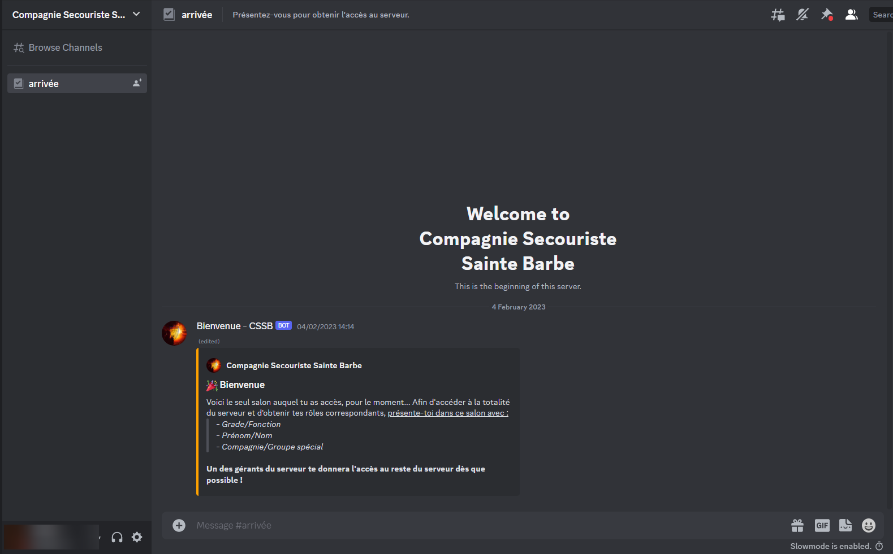
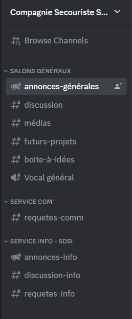
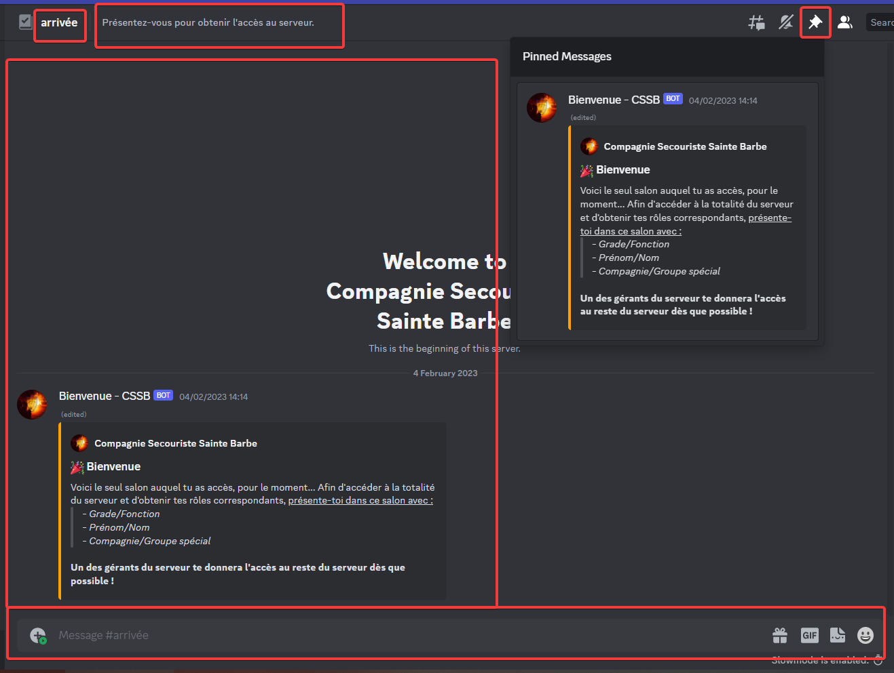

-----

# Table des matières

- [Introduction](#introduction)
- [Rejoindre le serveur](#rejoindre-le-serveur)
- [Utilisation du serveur](#utilisation-du-serveur)
- [Rôles](#rôles)

# Introduction

Le Discord de la CSSB est un lieu de discussion et d'échange entre les membres de l'association. Il est ouvert à tous les membres de l'association, ainsi qu'aux personnes extérieures à l'association qui souhaitent nous rejoindre.

# Rejoindre le serveur

## Créer un compte Discord

1. Cliquer sur le lien suivant : [https://discord.com/register](https://discord.com/register)
2. Remplir le formulaire d'inscription
3. Valider l'inscription en cliquant sur le lien reçu par mail

## Rejoindre le serveur

1. Cliquer sur le lien d'invitation au serveur Discord. Si vous ne l'avez pas, vous pouvez le demander à **comm [at] cssb.fr** ou à **remi [at] cssb.fr**.
2. Si vous êtes déjà connecté à Discord, vous serez directement redirigé vers le serveur. Sinon, vous devrez vous connecter à votre compte Discord.
3. Vous êtes maintenant sur le serveur Discord de la CSSB, vous devriez voir la page de bienvenue suivant :

4. Vous pouvez désormais envoyer un message de présentation dans ce même salon de discussion, pour qu'un administrateur vous accorde l'accès aux autres salons de discussion.

# Utilisation du serveur

Les différents salons de discussion et catégories sont affichés sur la gauche de l'écran. Vous pouvez cliquer sur un salon pour y accéder.
Par défaut, vous avez accès aux salons suivants :

Les salons sont organisés dans différentes catégories: `Salons généraux`, `Service Com'`, ou `Service Info - SDSI`. Vous n'avez pas forcément les mêmes accès à chaque salon, en fonction de votre rôle sur le serveur, certains salons peuvent être cachés, ou vous pouvez ne pas avoir la permission d'y écrire.

Les salons dont le nom est précédé d'un `#` sont des salons de discussion textuels, vous pouvez y écrire des messages. Les salons dont le nom est précédé d'un `🔊` sont des salons de discussion vocaux, vous pouvez y rejoindre un appel vocal. Pour rejoindre un salon, il suffit de cliquer dessus. 

Les salons `#requete-comm` et `#requete-info` sont des salons de requêtes, vous pouvez y demander de l'aide ou poser des questions. Les membres du service concerné seront notifiés de votre message et pourront vous répondre.

### Organisation d'un salon de discussion

En haut à gauche, vous pouvez voir le nom du salon, en blanc, ainsi que sa courte description à côté en gris. 
En haut à droite, avec une icone de punaise, vous pouvez voir les messages épinglés, qui sont des messages importants, à lire en priorité.
Au milieu, vous pouvez voir les messages du salon, avec le nom de l'auteur, la date et l'heure d'envoi, ainsi que le contenu du message.
En bas, vous pouvez voir la zone de saisie de texte, pour envoyer un message.

# Rôles

Les rôles permettent de définir les droits des membres sur le serveur, ainsi que leur appartenance à un groupe, service, ou compagnie.

| Rôle | Description |
| :----: | ----------- |
| `Administrateur` | Configurent le Discord, et donnent l'accès aux nouveaux arrivants |
| `CSSB` | Donné à tous les membres acceptés |
| | |
| `Directeur de camp` | Tout membre faisant partie de la direction sur le camp |
| `Resp. Comm. National` | Responsable Communication National |
| `Service Communication` | SERCOM  - Donné à tout membre du SerCom, donne accès aux salons SerCom |
| `Resp. Info. National` | Référent Moyens Internet |
| `Service Informatique` | SDSI - Donné à tout membre de la SDSI, donne accès aux salons SDSI |
| `Resp. Log. National` | Référent Logistique National |
| `Service Logistique` | SERLOG - Donné à tout membre du SerLog, donné accès aux salons SerLog |
| | |
| `1ère - France` | Est ou a été à la 1ère compagnie |
| `2ème - La Radieuse` | Est ou a été à la 2ème compagnie |
| `3ème - La Frondeuse` | Est ou a été à la 3ème compagnie |
| `4ème - Les Fraisiers` | Est ou a été à la 4ème compagnie |
| `CSAO` | Membre qui n'est plus actif en compagnie mais au niveau national |
| `6ème - L'insolente` | Est ou a été à la 6ème compagnie |
| `7ème - La Royale` | Est ou a été à la 7ème compagnie |
| `8ème - Squilarum Scholae` | Est ou a été à la 8ème compagnie |
| `9ème - La Résiliente` | Est ou a été à la 9ème compagnie |
| `10ème - La Rugissante` | Est ou a été à la 10ème compagnie |