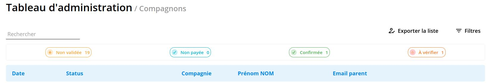
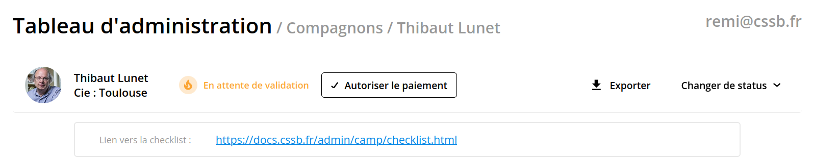
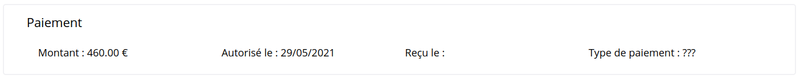
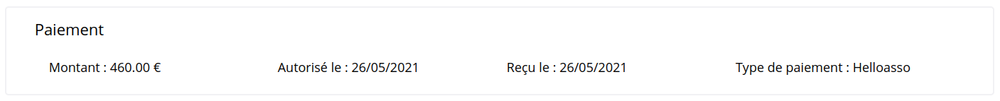
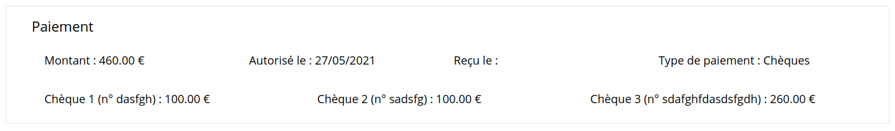
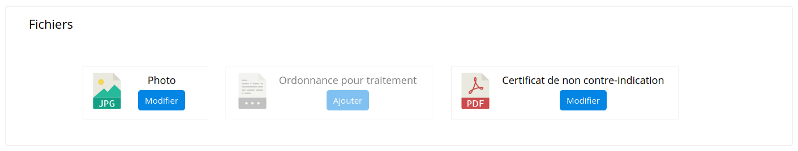

1. [Rappel du processus d'inscription](#rappel-du-processus-dinscription)
2. [Voir la liste des inscriptions](#voir-la-liste-des-inscriptions)
3. [Gérer les différents statuts d'inscription](#gérer-les-différents-statuts-dinscription)
4. [Modifier les fichiers d'un dossier](#modifier-les-fichiers-dun-dossier)

## Rappel du processus d'inscription

Pour le cas des compagnons, l'inscription complète s'effectue en plusieurs étapes.

1. Le parent inscrit un ou plusieurs enfants sur le site,
2. Une (ou un) secrétaire vérifie que les informations et pièces envoyées sont correctes, [**voir la checklist**](./checklist.md)
3. L'inscription pour chaque enfant est validée,
4. Un mail est envoyé au parent pour le paiement,
5. En suivant le lien envoyé par mail, le parent paie
   - par carte via Helloasso
   - par chèque, et envoie le ou les chèques par la poste à la secrétaire générale
6. Le paiement est validé
   - automatiquement si paiement par Helloasso
   - par la secrétaire générale lorsque les chèques sont reçus
7. L'inscription est confirmée, et le compagnon aura la joie immense de pouvoir participer au camp.

Le déroulement est similaire pour les chefs, à la différence qu'il n'y a qu'un seul chef à valider par inscription, et que le mail pour le paiement lui est envoyé directement. De même pour les directeurs de camp et aumôniers, qui eux n'ont pas à payer le camp.

## Voir la liste des inscriptions

La barre de navigation à gauche vous permet d'accéder aux différentes listes d'inscription pour la (ou les) companie(s) qui vous concernent.
Pour les compagnons, par exemple, vous arrivez sur une page dont le haut ressemble à ça :

Quelques fonctionnalités sont à votre disposition pour (si possible) vous simplifier la vie :

1. **barre de recherche** : à gauche, permet de rechercher un compagnon avec une partie de son nom ou prénom, ou même le numéro de chèque utilisé pour le paiement.
2. **filtres par compagnies** : à droite, permettent de n'afficher que certaines compagnies (pour la secrétaire générale et les directeurs de camp, par exemple).
3. **tri par colonnes** : cliquer sur le titre d'une des colonnes (Date, Status, ...) permet de trier la liste des inscriptions selon cette colonne. Cliquer à nouveau permet de changer l'ordre de tri.

Enfin, cliquer sur la ligne de l'un des compagnons permet d'accéder à une page contenant l'ensemble des informations le concernant.

## Gérer les différents statuts d'inscription

Au cours du processus, chaque inscription aura un statuts, qui est sensé évoluer dans cet ordre

**Status 1 : En attente de validation**  : une fois qu'un parent (ou un chef) a entièrement rempli le formulaire, l'inscription est enregistrée sur le site, et le haut de la page ressemble à ça :

Une fois les informations et pièces jointes vérifiées, il est possible de **valider** l'inscription en cliquant sur "Autoriser le paiement".
Cela va envoyer un mail au parent afin qu'il puisse procéder au paiement, et on passe au statut suivant.

**Status 2 : Paiement en attente** : après l'étape précédente, le haut de la page d'un dossier compagnon devient similaire à la précédente, mais avec le statut "Paiement en attente" ainsi qu'une section paiement ressemblant à

La date d'autorisation correspond à la date à laquelle l'inscription a été validée.

 - Dans le cas d'un **paiement par Helloasso**, le statut sera changé en "Inscription confirmée" une fois le règlement effectué, et vous pourrez voir quelquechose comme :

- Dans le cas d'un **paiement par chèque(s)**, il faut attendre que le parent indique, grâce au lien qu'il a reçu avec le mail de paiement, qu'il veut régler par chèque, et note les numéros.
Une fois que c'est fait, la section paiement prendra la forme suivante (par exemple, dans le cas de plusieurs chèques):

Une fois les chèques bien reçus par la secrétaire générale, celle-ci peut cliquer sur "Confirmer réception du paiement". À ce moment, le status sera changé en "Inscription confirmée" et l'information de la date pour le champ "Reçu le" sera indiquée.

**Status 3 : Inscription confirmée** : mission accomplie !

## Modifier les fichiers d'un dossier

Tout en bas de la page d'administration pour un dossier personnel (compagnon, chef, ...), une section vous permet d'administrer les fichiers joints au dossier.
Par exemple, pour un compagnon, cela donne :

- cliquez sur l'icône pour la télécharger (par exemple, pour vérifier que tout est en ordre)
- cliquez sur modifier pour changer la pièce

Pour supprimer un fichier, veuillez juste envoyer un mail à remi@cssb.fr.