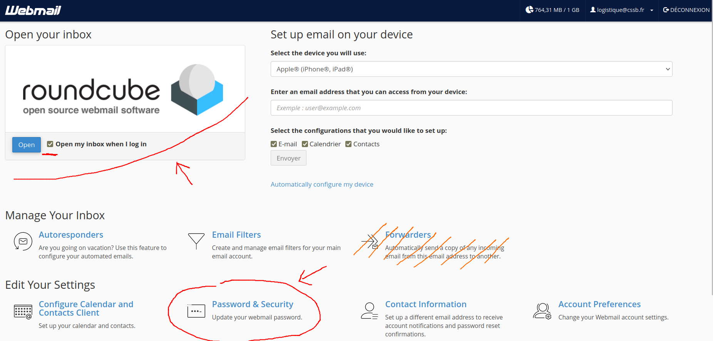
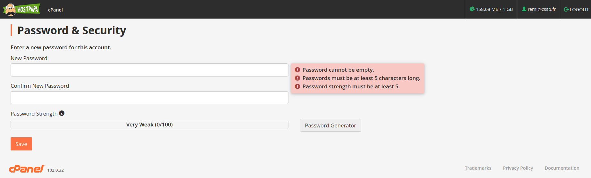

A l’aide d’un navigateur internet (Firefox, Google Chrome, Microsoft Edge, Safari, ...), aller sur la page
suivante : 

    <a href="https://webmail.cssb.fr/webmail/jupiter" target="_blank" rel="noopener noreferrer">
        https://webmail.cssb.fr/webmail/jupiter
    </a>

Entrer l'adresse mail `[...]@cssb.fr` comme identifiant, et le mot de passe CSSB (transmis avec l'adresse mail). Vous accéder alors à une page sous cette forme (probablement en français pour vous ...):

Il s'agit du **`Webmail Home`**. Cette page vous permet de :

- Lire et envoyer des mails avec l’interface Roundcube (en haut à gauche). **Ne jamais cliquer sur `Horde`, cette interface est horrible !**
- Changer votre mot de passe : voir `Password & Security`, en bas
- Voir les réglages serveurs pour configurer un logiciel client : voir `Configure Mail Client`, plus bas encore

> :warning: **Ne pas utiliser `Forwarders`** pour envoyer les emails reçus depuis cette boite mail sur une adresse personnelle. Ceci n'est pas une bonne approche, surtout lorsque vous transmettez le compte à la personne qui vous succède, donc **non accepté à la CSSB**.

## Changement du mot de passe

:scroll: _Étape nécessaire lors de toute première connection à un compte mail._

Dans `Webmail Home`, cliquez sur `Password & Security`, ce qui vous emmène sur cette page :

Entrez (deux fois) votre nouveau mot de passe, en vous assurant qu'il respecte les conditions indiquées par le site.
Enfin, cliquez sur `Save` pour enregister votre nouveau mot de passe. À tout moment, vous pouvez revenir sur le `Webmail Home` en cliquant sur `Hostpapa` en haut à gauche.

> :mega: Après avoir changé de mot de passe, il est **vivement conseillé** de changer le mot de passe du compte Google associé.