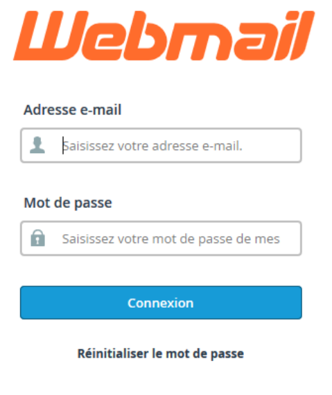
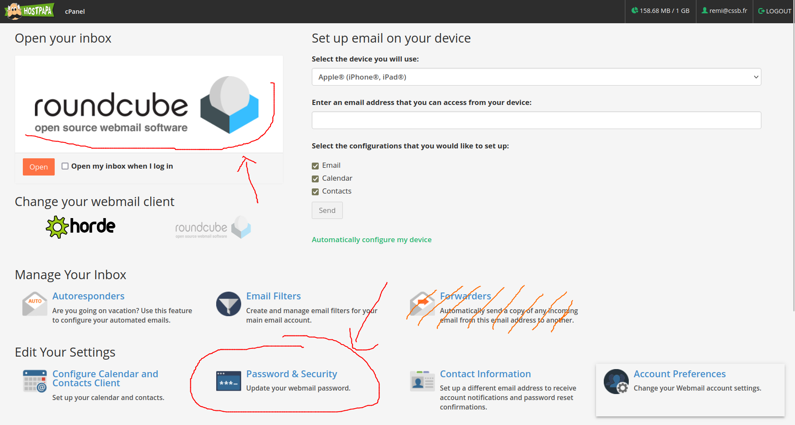
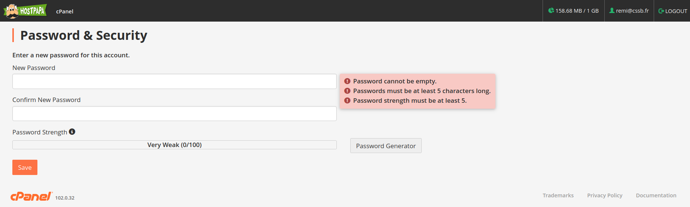
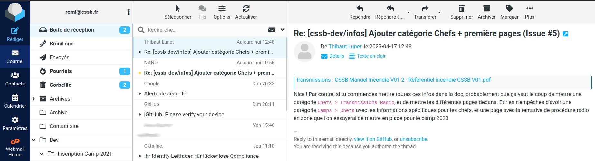

----

1. [Première connexion](#première-connexion)
2. [Changement du mot de passe](#changement-du-mot-de-passe)
3. [Utilisation du webmail - RoundCube](#utilisation-du-webmail---roundcube)
4. [Utilisation d'un logiciel client](#utilisation-dun-logiciel-client)

## Première connexion

A l’aide d’un navigateur internet (firefox, google chrome, internet explorer, safari, ...), accédez à la page
suivante : [https://webmail.cssb.fr/](https://webmail.cssb.fr/)

Vous arrivez sur une page qui ressemble à ça :

Entrer l'adresse mail `[...]@cssb.fr` comme identifiant, et le mot de passe CSSB (transmis avec l'adresse mail). Vous accéder alors à une page sous cette forme (si ce n'est pas le cas, aller directement à la [section sur RoundCube](#utilisation-du-webmail---roundcube)) :

Il s'agit du **`Webmail Home`**. Cette page vous permet de :

- Lire et envoyer des mails avec l’interface Roundcube (en haut à gauche). **Ne pas cliquer sur `Horde` !**
- Changer votre mot de passe (`Password & Security`, en bas)
- Voir les réglages serveurs pour configurer un logiciel client mail comme Outlook, Thunderbird, ou un smartphone (plus bas encore, `Configure Mail Client`)

> :warning: **Ne pas utiliser `Forwarders`** pour envoyer les emails reçus depuis cette boite mail sur une adresse personnelle. Ceci n'est pas une bonne approche, surtout lorsque vous transmettez le compte à la personne qui vous succède, donc **non accepté à la CSSB**.

> :bulb: **Conseil** : vous pouvez cochez la case `Open my inbox when I log in` pour arriver directement sur Roundcube
après votre connexion. Dans ce cas, il est possible de retourner sur cette page depuis Roundcube en cliquant
sur `Webmail Home` dans le menu à gauche.

## Changement du mot de passe

:scroll: _Cette étape n'est pas nécessaire, mais peut être effectuée si vous voulez personnaliser votre mot de passe pour le retenir plus facilement._

Dans `Webmail Home`, cliquez sur `Password & Security`, ce qui vous emmène sur cette page :

Entrez (deux fois) votre nouveau mot de passe, en vous assurant qu'il respecte les conditions indiquées par le site. Vous pouvez vous aider du `Password Generator` pour en générer un automatiquement. 

Enfin, cliquez sur `Save` pour enregister votre nouveau mot de passe. À tout moment, vous pouvez revenir sur le `Webmail Home` en cliquant sur `Hostpapa` en haut à gauche.

> :mega: Si vous changez votre mot de passe CSSB (pour le webmail), il vous est **vivement conseillé** de change le mot de passe du compte google associé.

## Utilisation du webmail - RoundCube

Une fois que vous avez cliqué sur `roundcube` dans la page `Webmail Home` (ou si la case `Open my inbox when I log in` a été cochée), vous accéder à la page suivante :

Cette page vous permet de voir les mail reçus (colonne du milieu), de les afficher (colonne de droite) et de naviguer parmis les dossiers de mails créés pour ce compte.

Il y à aussi un menu complètement à droite, qui permet en particulier :

- d'écrire un nouveau message : `Rédiger`
- d'accéder à cette boite mail : `Courriel`
- de gérer les paramètres du compte mail : `Paramètres`
- de retourner au `Webmail Home`

L'interface reste assez intuitive et moderne depuis les dernières mises-à-jour, donc elle peut suffire à la plupart des utilisations.

> :mega: Via `Paramètres > Identités > [...]@cssb.fr`, il est possible d'insérer une [signature email officielle CSSB](./signature.md). 

> :bulb: Si vous avez déjà plusieurs adresse mail, ou souhaiter recevoir les mails sur votre smartphone, jetez donc un coup d'oeil à la section suivante ...

## Utilisation d'un logiciel client

:hammer_and_wrench: EN CONSTRUCTION :hammer_and_wrench:

