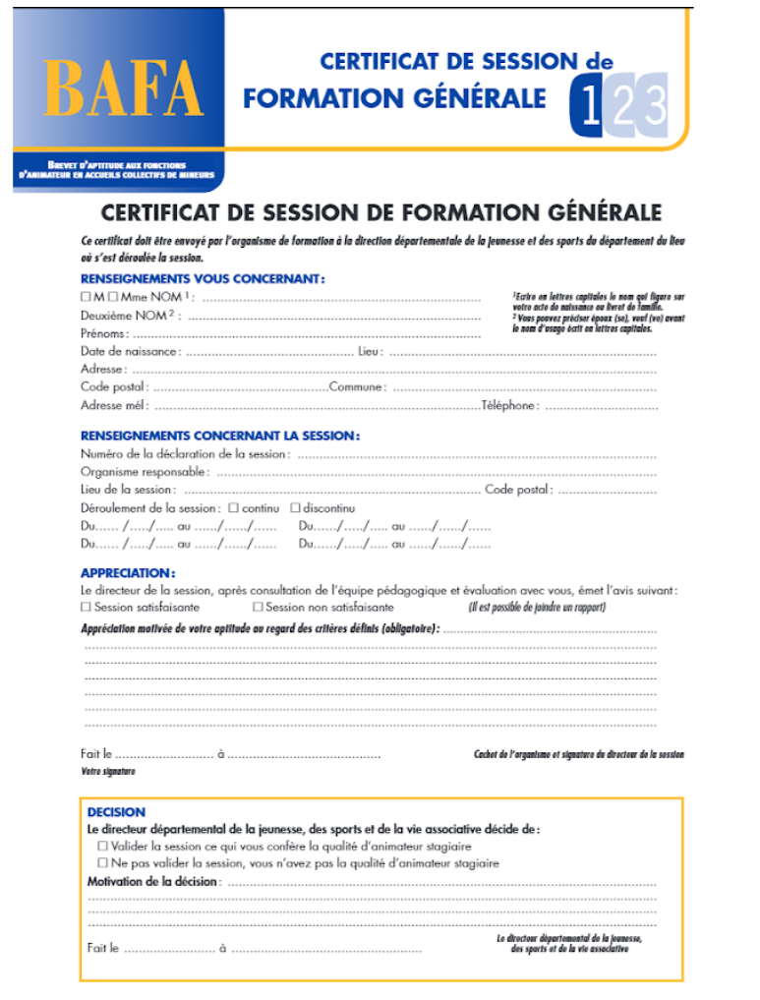
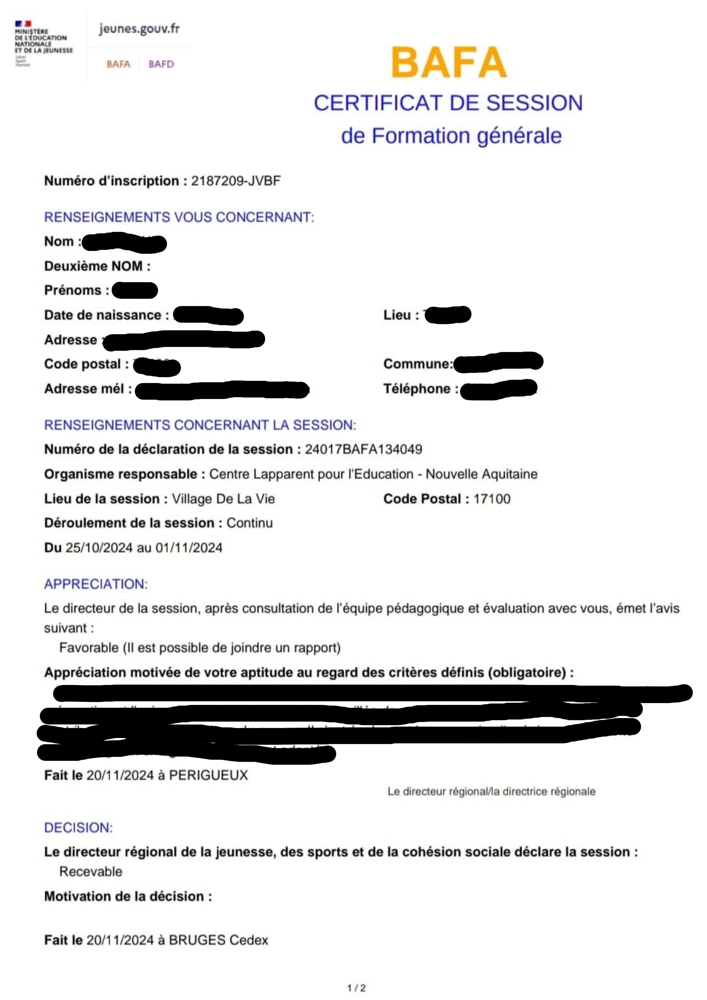
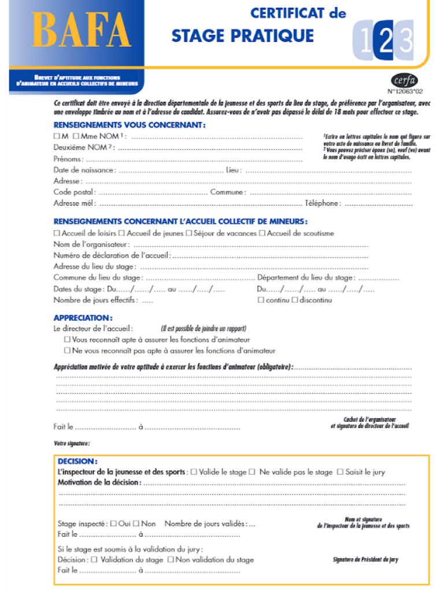
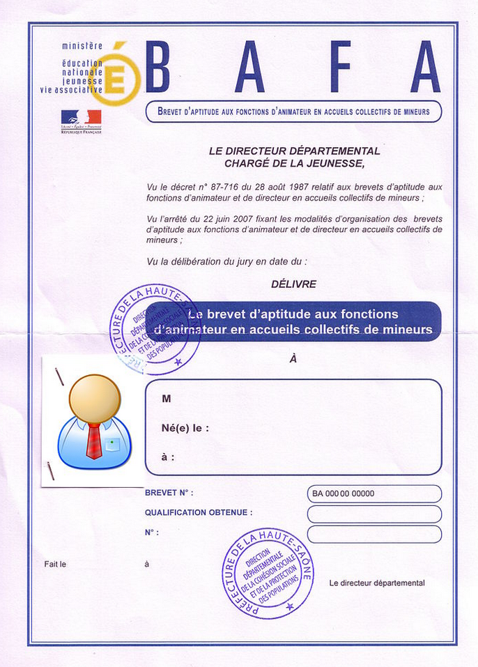
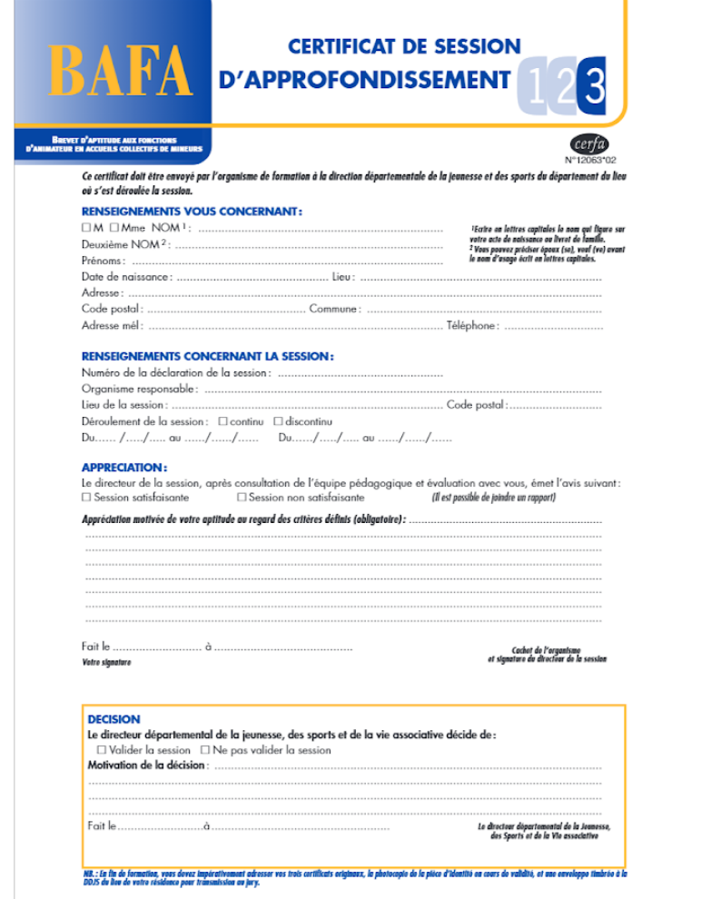
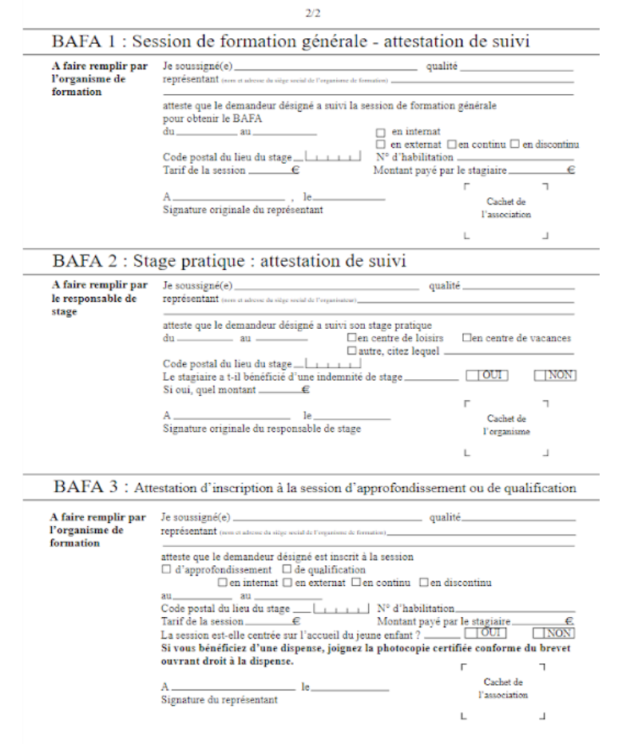

:arrow_left: [Retour à la Checklist](../checklist.md)

## Exemples de document BAFA acceptés

### BAFA 1

- Certificat de **Formation Générale** :

_Ancienne Version_ 

_Nouvelle Version (depuis 2025)_

### BAFA 2

- Certificat de **Stage Pratique** :

### BAFA (Complet)

- **Diplôme du BAFA** :

> :warning: le certificat BAFA 3 n'est plus accepté comme document pour le BAFA (Complet)

## Exemples de document BAFA **non** acceptés

-  Certificat de **Session d'Approfondissement** pour le BAFA (Complet) :

- Fiche de suivi :

:arrow_left: [Retour à la Checklist](../checklist.md)
