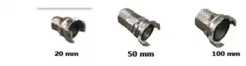
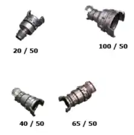

## Raccords : ##

Constitués de demi-raccords, ils servent à brancher 2 tuyaux, 1 tuyaux et une prise d’eau etc.. entre eux. Il en existe donc plusieurs types:

*   **Les demi-raccords :**  
 
Ils servent essentiellement à raccorder deux tuyaux entre eux:
 

 
 
 
*   **Raccords intermédiaires et de réduction :**

  Ce sont des pièces de jonction comportant deux raccords d’un modèle différent, montées sur
un même corps. 
 

 
 
